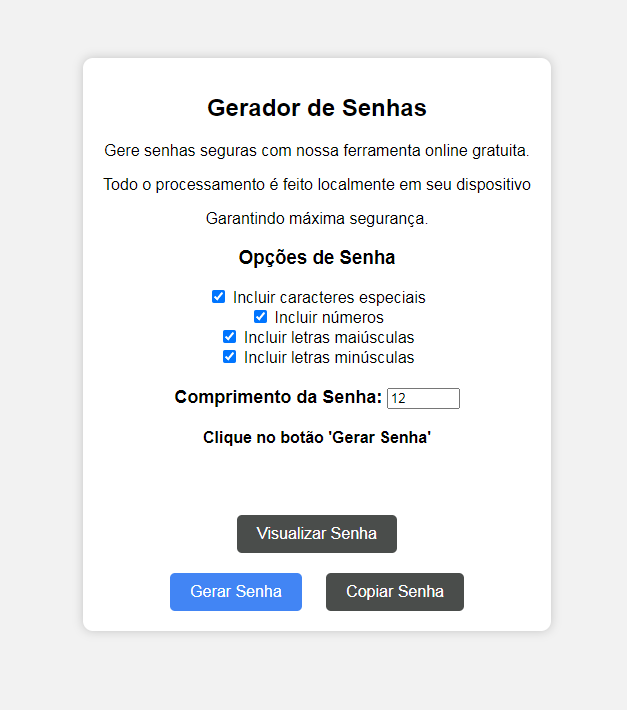

# Gerador de Senha Online Grátis

Este é um simples gerador de senhas online que permite a criação rápida e segura de senhas robustas. Destacamos algumas características principais deste gerador de senha:

# Características:
Gratuito: Nosso gerador de senhas é totalmente gratuito, proporcionando uma solução eficaz para a criação de senhas seguras.

Segurança Máxima: Todo o processamento é realizado localmente em seu dispositivo, garantindo a máxima segurança. Não armazenamos ou processamos suas informações em servidores externos.

Opções Personalizáveis: Personalize suas senhas conforme suas necessidades. Escolha incluir caracteres especiais, números, letras maiúsculas e minúsculas, de acordo com as exigências de segurança desejadas.

# Automação de Testes:
Este projeto utiliza testes automatizados para garantir a funcionalidade correta do Gerador de Senhas. Os testes são escritos usando o framework de teste Cypress.

## Estrutura dos Testes

Os testes estão organizados em cenários específicos para garantir uma cobertura abrangente do Gerador de Senhas.

### Verificar Senhas Geradas

1. **Senhas Contêm Caracteres Especiais:**
   - Desmarca todos os checkboxes.
   - Gera uma senha com caracteres especiais marcados.
   - Verifica se a senha contém apenas caracteres especiais.

2. **Senhas Contêm Números:**
   - Desmarca todos os checkboxes.
   - Gera uma senha com números marcados.
   - Verifica se a senha contém apenas números.

3. **Senhas Contêm Letras Maiúsculas:**
   - Desmarca todos os checkboxes.
   - Gera uma senha com letras maiúsculas marcadas.
   - Verifica se a senha contém apenas letras maiúsculas.

4. **Senhas Contêm Letras Minúsculas:**
   - Desmarca todos os checkboxes.
   - Gera uma senha com letras minúsculas marcadas.
   - Verifica se a senha contém apenas letras minúsculas.

### Verificar Tamanho da Senha

5. **Tamanho da Senha Gerada:**
   - Define um comprimento de senha específico.
   - Desmarca todos os checkboxes.
   - Gera uma senha.
   - Verifica se o tamanho da senha é igual ao comprimento especificado.

# Como Usar:

Opções de Senha:
Marque as caixas de seleção para incluir caracteres especiais, números, letras maiúsculas e minúsculas nas suas senhas.

Comprimento da Senha:
Defina o comprimento desejado para suas senhas usando o campo "Comprimento da Senha".

Gerar Senha:
Clique no botão "Gerar Senha" para criar uma senha conforme suas especificações.

Visualizar Senha (Opcional):
Se desejar visualizar a senha gerada, clique no botão "Visualizar Senha". A senha será exibida no campo correspondente.

Copiar para a Área de Transferência:
Depois de gerar a senha, utilize o botão "Copiar para a Área de Transferência" para copiá-la e usá-la conforme necessário.

# Nota Importante:
Este gerador de senha é projetado para ser uma ferramenta prática e segura para criar senhas robustas. Certifique-se de armazenar suas senhas com segurança e evite compartilhá-las indiscriminadamente.
